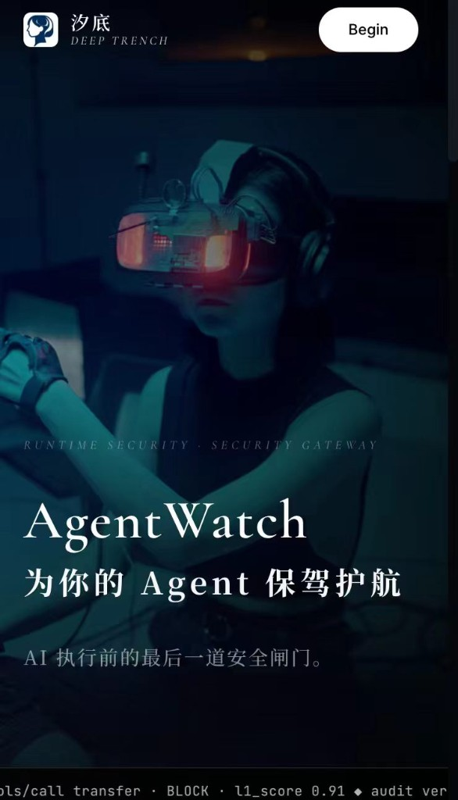
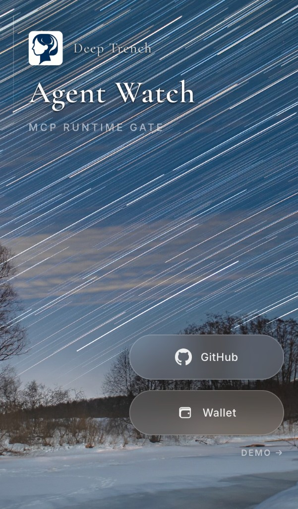
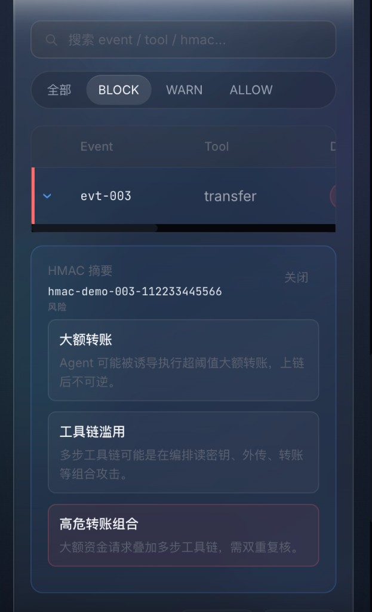
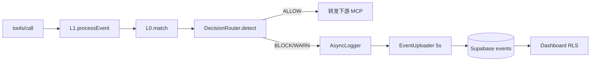

# AgentWatch — MCP Web3 安全审计

> **Monorepo**：本地 CLI 中间件 + Web Dashboard  
> **npm 包**：[@agentwatch-web3/cli](https://www.npmjs.com/package/@agentwatch-web3/cli) **v0.2.0** · Node.js ≥ 18  
> **CLI 命令**：`agentwatch-web3`（主）/ `agentwatch`（兼容别名）

AgentWatch 部署在 AI Agent 与 MCP Server 之间，拦截每一次 `tools/call`，在本地完成 **L0 规则 + L1 统计** 检测，输出 ALLOW / WARN / BLOCK，写入 HMAC 防篡改审计日志；BLOCK/WARN 可脱敏上报 Supabase，Dashboard 实时展示。

---

## 界面预览

<p align="center">
  
  
</p>

<p align="center">
  
</p>

Web 端支持 **GitHub 登录**、**Wallet（SIWE）**；Live 模式见 [`docs/LOGIN_SETUP.md`](docs/LOGIN_SETUP.md)。

> 背景视频等大体积静态资源默认不入库，本地开发见 [`packages/web/public/assets/videos/README.md`](packages/web/public/assets/videos/README.md)。

---

## V0 能力边界

| 已实现（本仓库） | 未实现（见 [产品架构](docs/产品架构完整版.md) §11） |
|------------------|-----------------------------------------------------|
| stdio MCP 代理、FIFO Demo 注入 | L2 孤立森林 / L3 深度学习 |
| L0 8 规则 + L1（Z-score / 频率 / Markov） | CUSUM / EWMA（V1） |
| DecisionRouter 加权融合 | CHALLENGE 人机验证（V2） |
| JSONL + HMAC 链 + SQLite 持久化 | WebSocket 云端实时通道（V1） |
| Supabase 批量上报 + Login + Dashboard | 完整 ASP 付费分析服务 |
| `audit verify` 链完整性验收 | 多租户 / SSO |

---

## 快速开始

### 1. 安装 CLI（日常使用）

```bash
npm install -g @agentwatch-web3/cli@0.2.0
agentwatch-web3 init

# 被代理 MCP 的凭证写入 config.yaml server.env 或 export 对应变量
agentwatch-web3 proxy -- npx -y <your-mcp-server-package>

# 触发若干 tools/call 后：
agentwatch-web3 audit verify
```

本地零依赖 Demo：

```bash
agentwatch-web3 proxy -- node /path/to/agent-watch-v0/scripts/echo-mcp.js
```

### 2. 源码开发

```bash
git clone <repo> agent-watch-v0 && cd agent-watch-v0
npm install && npm run build && npm test
```

### 3. Dashboard 闭环（三终端）

**Terminal 1 — Web**

```bash
cd packages/web && npm run dev
# Settings 绑定 install_id = config.yaml 的 agentId
# .env.local: VITE_USE_MOCK=false
```

**Terminal 2 — Proxy（须用本仓库 build，勿用旧版全局包）**

```bash
export AGENTWATCH_API_KEY="<Supabase publishable key>"
export AGENTWATCH_UPLOAD_SECRET="<upload_secret>"
bash scripts/phase-d-proxy.sh
```

**Terminal 3 — 测试**

```bash
bash scripts/phase-d-test-cases.sh block-transfer
# 或完整演示：dashboard-demo
```

刷新 Dashboard 即可看到上报事件。详细步骤：[Phase D Runbook](docs/phase_d_dashboard_runbook.md)

---

## CLI 命令

| 命令 | 作用 |
|------|------|
| **`init`** | 生成 `~/.agentwatch/config.yaml`、`uploadSecret`、MCP 配置注入 |
| **`proxy`** | 启动 MCP 网关；拦截 `tools/call` |
| **`status`** | MCP / SQLite / 云端 / 近 1h 风险自检 |
| **`logs`** | 查看 `log.jsonl`（`--tail` / `--level` / `--since` / `--follow`） |
| **`audit verify`** | HMAC 链完整性验收（exit 0 = 通过） |

```bash
agentwatch-web3 audit verify --json
# {"valid":true,"count":127,"tamperedIndex":null}
echo $?   # 0=通过, 1=篡改/错误, 2=参数错误
```

---

## Web Dashboard

| 模块 | 路径 | 说明 |
|------|------|------|
| 登录 | `/auth` | GitHub OAuth · Wallet（SIWE）；Live 需 Session |
| Dashboard | `/dashboard` | `VITE_USE_MOCK=false` 且已登录时读 Supabase `events` |
| Settings | `/settings` | 绑定 `install_id`（= CLI `agentId`）与上报密钥 |

云端 DDL 与部署：[docs/supabase/DEPLOY_LOGIN.md](docs/supabase/DEPLOY_LOGIN.md)

---

## 架构概览

```
agent-watch-v0/
├── packages/local/          # CLI + MCP 代理 + L0/L1 + 存储 + 云端上报
│   ├── cli/                 # init · proxy · status · logs · audit
│   ├── proxy/               # MCPProxyCore
│   ├── rule/ · stat/        # L0 / L1
│   ├── detection/           # DecisionRouter · 场景检测
│   ├── logging/             # AsyncLogger
│   ├── cloud/               # EventUploader · Supabase Edge Function 适配
│   └── storage/             # SQLite (better-sqlite3)
├── packages/shared/         # types · constants（全局契约）
├── packages/web/            # Vite + React Dashboard（不进 npm 包）
├── supabase/functions/      # upload-events Edge Function
├── scripts/                 # phase-d-proxy · test-cases · echo-mcp
└── docs/                    # 架构 · 任务 · 运维
```

### 检测链路



### 本地数据目录

```
~/.agentwatch/
├── config.yaml          # agentId · cloud.uploadSecret · 检测阈值
├── log.jsonl            # HMAC 审计链（_meta.hmac）
├── .hmac_key            # 0600
├── agentwatch.db        # 基线 · 上报队列 · perm_probe
├── gateway.in.fifo      # Demo 外部注入（proxy 运行时创建）
└── rules/
```

---

## 环境变量

| 变量 | 用途 |
|------|------|
| `AGENTWATCH_API_KEY` | Supabase publishable key（Edge Function 网关） |
| `AGENTWATCH_UPLOAD_SECRET` | CLI 上报密钥（覆盖 yaml；Dashboard 闭环必填） |
| `server.env.*` | 被代理 MCP Server 所需凭证（见 `config.yaml`） |

Demo 占位：`scripts/phase-d-proxy.sh` 内置下游 MCP 凭证占位变量，配合 `scripts/echo-mcp.js` 可零外部依赖冒烟；生产请在 `config.yaml` 的 `server.env` 配置真实凭证。

---

## 云端上报（Supabase）

- **协议**：`POST {project}/functions/v1/upload-events`
- **Body**：`install_id` + `upload_secret` + `events[]`（snake_case）
- **过滤**：仅 BLOCK/WARN 入队；ALLOW 仅本地
- **约定**：`install_id === config.agentId`

源码：`packages/local/src/cloud/supabaseCloudTransport.ts`

---

## 性能（V0 基准）

| 指标 | 目标 | 参考 |
|------|------|------|
| L0 P99 | < 10ms | ~0.4–1.2ms |
| L1 P99 | < 50ms | ~0.5–3ms |
| E2E handleToolCall | < 50ms | ~2–30ms |

```bash
npm run bench   # 详见 packages/local/tests/bench/results.md
```

---

## 功能自检

| 检查项 | 命令 / 期望 |
|--------|-------------|
| 单元 + 集成测试 | `npm test` → **299 passed** / 2 skipped |
| tarball 冒烟 | `npm run pack:verify` |
| HMAC 链 | `agentwatch-web3 audit verify` → exit 0 |
| 本地 BLOCK | `bash scripts/phase-d-test-cases.sh block-transfer` → proxy 返回 -32000 |
| 云端写入 | proxy 日志 `CloudUpload 批量上报完成`；Supabase `events` 计数增加 |
| Dashboard | 绑定正确 `install_id` 后可见 BLOCK 行 |

完整架构对照：[docs/architecture_review_report.md](docs/architecture_review_report.md) · [产品架构 As-Built](docs/产品架构完整版.md#v0-as-built-自检快照)

---

## 常见报错

| 症状 | 处理 |
|------|------|
| `handleToolCall failed` | 用最新 `npm run build`；DecisionRouter 预算已对齐 10ms |
| Dashboard 无新数据 | 确认 `AGENTWATCH_UPLOAD_SECRET`；Settings `install_id` = `agentId` |
| Cloud 上报失败 | 勿用旧全局 npm 包；跑 `bash scripts/phase-d-proxy.sh` |
| `command not found: agentwatch-web3` | `npm install -g @agentwatch-web3/cli@0.2.0` |
| FIFO 不存在 | 先启动 `phase-d-proxy.sh` |
| GitHub / Wallet 登录失败 | 检查 Supabase Auth Provider 与 `.env.local`（见 DEPLOY_LOGIN.md） |

更多：[docs/operation_troubleshoot.md](docs/operation_troubleshoot.md)

---

## 开发者

```bash
npm run build          # tsc → dist/
npm test               # Vitest 全量
npm run typecheck      # 可选
npm run pack:verify    # build + tarball 安装冒烟
npm link               # 本地全局链接 CLI
```

### 文档索引

| 文档 | 说明 |
|------|------|
| [**登录落地手册**](docs/LOGIN_SETUP.md) | GitHub + Wallet 逐步配置与验收 |
| [产品架构完整版](docs/产品架构完整版.md) | 长期设计 SSOT（V0→V2） |
| [MVP 任务清单](docs/agentwatch_v0_mvp_tasklist.md) | 63 项任务与接口契约 |
| [架构复查报告](docs/architecture_review_report.md) | V0 as-built 对照 |
| [Phase D Runbook](docs/phase_d_dashboard_runbook.md) | Dashboard 三终端演示 |
| [Supabase 部署](docs/supabase/DEPLOY_LOGIN.md) | DDL · Edge Function · 登录 |
| [NPM 打包验证](docs/npm_pack_verify.md) | pack 安装流程 |
| [运维 FAQ](docs/operation_troubleshoot.md) | 排障 |

---

## 审计验收

第三方或买家可按以下步骤验收本地审计链，**不依赖云端**：

```bash
agentwatch-web3 init
agentwatch-web3 status
# 运行 proxy 并产生 tools/call 后：
agentwatch-web3 audit verify
agentwatch-web3 audit verify --json && echo $?
```

- 隐私：四级脱敏 + `cloud.enabled: false` 可关上报
- Demo：`bash scripts/a2a-demo.sh` · `bash scripts/phase-d-test-cases.sh dashboard-demo`

---

## 版本

| 版本 | 说明 |
|------|------|
| 0.1.0 | 首包 |
| 0.1.1 | 双 bin `agentwatch-web3` / `agentwatch` |
| **0.1.2** | 修复 commander 生产依赖；Supabase 上报适配 |
| **0.2.0** | Live 登录（GitHub/Wallet）、激活码门禁、审计详情增强、码池管理工具；**当前稳定版** |

Dashboard 源码在 `packages/web`，需单独 `npm run dev` / 部署；CLI 已通过 npm 发布。

---

## License

ISC
