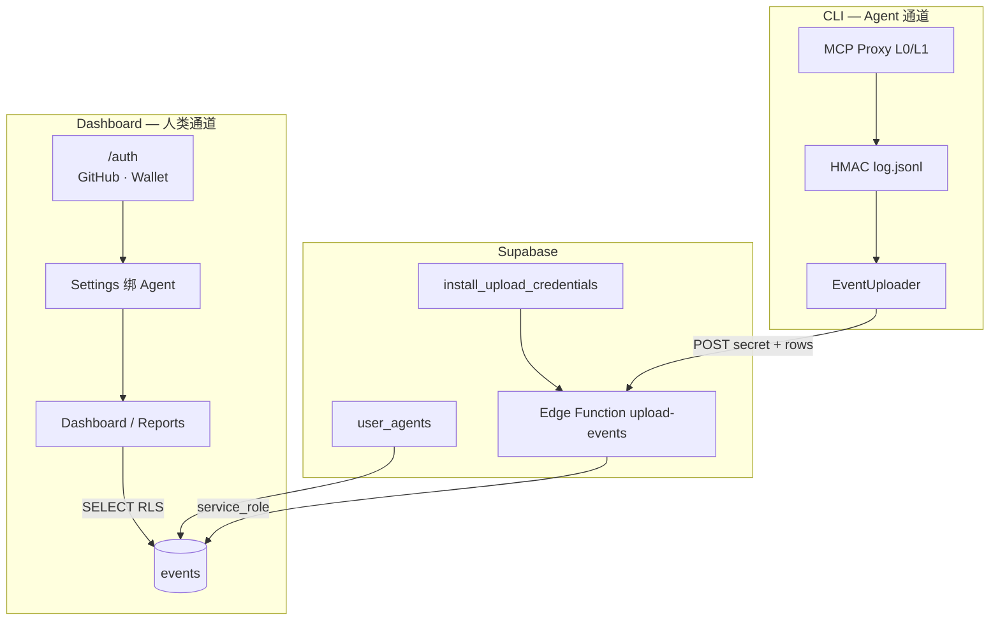

# AgentWatch 登录系统 — GitHub + Wallet 落地手册（v1）

> **唯一 SSOT**：人类 Dashboard 登录、Agent 绑定、CLI 上报鉴权  
> **登录方式（v1 定稿）**：**GitHub OAuth** · **Wallet（SIWE / Ethereum）**  
> **不含**：Magic Link、邮箱密码、Demo 游客（Live 模式下）

---

## 一、要证明什么（North Star）

```text
用户在 /auth 用 GitHub 或 Wallet 登录
  → 获得 Supabase Session（auth.uid()）
  → Settings 绑定 install_id（= CLI agentId）+ upload_secret
  → Dashboard / Reports 通过 RLS 只读「本人绑定的 install_id」events
  → CLI Proxy 独立通道：upload_secret → Edge Function → service_role 写入
  → 未登录 / 未绑定 / secret 错误 → 无法读他人数据或伪造写入
```

---

## 二、双通道身份（不要混）

| 通道 | 谁 | 凭证 | 能做什么 |
|------|-----|------|----------|
| **人类通道** | 浏览器用户 | Supabase Session（GitHub 或 Wallet） | 登录、绑 Agent、读 events |
| **Agent 通道** | 本地 CLI | `install_id` + `upload_secret` | 脱敏 events 上报（无网页 Session） |

**命名统一**

| 字段 | 含义 |
|------|------|
| `install_id` | CLI `agentwatch init` 生成的 `agentId` |
| `auth.users.id` | Dashboard 登录用户 UUID |
| `events.user_id` | Agent 侧标识，**≠** 网页登录用户 |
| `upload_secret` | 每 install 独立上报密钥，库内只存 hash |

---

## 三、架构图



---

## 四、前端模式（只有两种）

| 模式 | 条件 | Dashboard 数据 | /auth 入口 |
|------|------|----------------|------------|
| **Live** | `VITE_USE_MOCK=false` + 已登录 | Supabase 真数据（RLS） | GitHub / Wallet |
| **Dev Mock** | `VITE_USE_MOCK=true`（默认） | 本地 Mock | 可跳过登录看 UI |

**Live 模式规则**

- `/dashboard` `/reports` `/settings` **必须** GitHub 或 Wallet Session
- **无 Demo 游客**；未登录 → 重定向 `/auth`
- Settings 显示 **「实时」** + 账户标签（`@github` 或 `0x…`）

---

## 五、Supabase 部署（一次性）

### 5.1 SQL（按顺序）

Supabase Dashboard → SQL Editor：

1. `docs/supabase/events_ddl.sql`（若 `events` 未建）
2. `docs/supabase/login_system_ddl.sql`（profiles · user_agents · RLS · RPC）
3. 若 digest 报错：先跑 `docs/supabase/fix_pgcrypto_digest.sql`

### 5.2 GitHub OAuth（当前项目 `kbjcikgoawxhotwwqtin`）

**一键打开**：https://supabase.com/dashboard/project/kbjcikgoawxhotwwqtin/auth/providers

1. [GitHub Developer Settings](https://github.com/settings/developers) → New OAuth App  
   - **Homepage URL**：`http://localhost:5173`  
   - **Authorization callback URL**：`https://kbjcikgoawxhotwwqtin.supabase.co/auth/v1/callback`
2. Supabase → **Authentication → Providers → GitHub** → 填 Client ID / Secret → **Enable**
3. **Authentication → URL Configuration**  
   - Site URL：`http://localhost:5173/`  
   - Redirect URLs：`http://localhost:5173/`

验收：`bash scripts/verify-login-setup.sh` 应显示 `GitHub OAuth 已启用`。

**若 GitHub 页显示 `redirect_uri is not associated with this application`（当前项目实测）**

Supabase 发起 OAuth 时用的是 **Client ID `Ov23li7MS94hWTwTkPQs`**，回调必须是：

`https://kbjcikgoawxhotwwqtin.supabase.co/auth/v1/callback`

你在 GitHub 里改的 **「AgentWatch Local Dev」** 若是另一个 Client ID，改它的 Callback **不会生效**——GitHub 只认请求里带的 Client ID。

**二选一（推荐 A）：**

| 方案 | 操作 |
|------|------|
| **A（推荐）** | [Supabase GitHub Provider](https://supabase.com/dashboard/project/kbjcikgoawxhotwwqtin/auth/providers) → 把 **AgentWatch Local Dev** 的 Client ID + Client Secret **完整粘贴进去** → Save |
| **B** | [GitHub Developer Settings](https://github.com/settings/developers) → 找到 Client ID **正好是** `Ov23li7MS94hWTwTkPQs` 的那个 App（不一定是 Local Dev 这个名字）→ 把 Callback 改成上面的 Supabase URL |

改完后 **硬刷新** `/auth` 再点 GitHub；不必加任何「换账号 / 刷新状态」按钮。

### 5.3 Wallet（SIWE）

1. Supabase → **Authentication → Providers → Web3 Wallet**
2. 启用 **Ethereum**（EIP-4361）
3. 用户浏览器需 MetaMask 等 `window.ethereum`

### 5.4 Edge Function（CLI 上报）

```bash
supabase link --project-ref YOUR_PROJECT_REF
supabase functions deploy upload-events --no-verify-jwt
```

自检（应 401 + `upload_credentials_not_found`）：

```bash
curl -s -w "\nHTTP:%{http_code}\n" -X POST \
  -H "Content-Type: application/json" \
  -d '{"install_id":"test","upload_secret":"bad","events":[]}' \
  https://YOUR_PROJECT.supabase.co/functions/v1/upload-events
```

---

## 六、前端 Live 配置

```bash
bash scripts/setup-login-live.sh
```

或手动：

```bash
cp packages/web/.env.example packages/web/.env.local
```

编辑 `packages/web/.env.local`：

```env
VITE_USE_MOCK=false
VITE_SUPABASE_URL=https://kbjcikgoawxhotwwqtin.supabase.co
VITE_SUPABASE_ANON_KEY=your-anon-key
```

验收：

```bash
bash scripts/verify-login-setup.sh
```

---

## 七、端到端验收（复制执行）

### Step 1 — CLI 初始化

```bash
cd /path/to/agent-watch-v0
npm run build

export OKX_API_KEY=demo OKX_SECRET_KEY=demo OKX_PASSPHRASE=demo OKX_PROJECT_ID=demo
export AGENTWATCH_API_KEY=your-supabase-anon-key

npx tsx packages/local/src/cli/index.ts init --force
grep agentId ~/.agentwatch/config.yaml
grep uploadSecret ~/.agentwatch/config.yaml   # 或 config 内 cloud.uploadSecret
```

### Step 2 — 登录 Dashboard

1. 打开 `http://localhost:5173/#/auth`
2. 点 **GitHub** 或 **Wallet**，完成 OAuth / 签名
3. 应跳转 `#/dashboard`；Settings 账户非「游客」

### Step 3 — 绑定 Agent

1. `#/settings`
2. **Agent ID** = Step 1 的 `agentId`
3. **上传密钥** = init 输出的 `upload_secret`
4. 点 **添加** → 显示「Agent 已接入」

### Step 4 — 产生事件

```bash
export AGENTWATCH_UPLOAD_SECRET="你的 upload_secret"
bash scripts/phase-d-proxy.sh
# 另一终端
bash scripts/phase-d-test-cases.sh block-transfer
```

### Step 5 — 验收

| # | 检查 | 期望 |
|---|------|------|
| 1 | Settings 数据模式 | **实时** |
| 2 | Dashboard 事件表 | 出现 BLOCK 行 |
| 3 | Supabase Table Editor | `events` 有新 `event_id` |
| 4 | 换未绑定 install_id | Dashboard 无数据 |
| 5 | 退出登录访问 Dashboard | 跳转 `/auth` |
| 6 | `agentwatch audit verify` | exit 0 |

---

## 八、代码入口索引

| 模块 | 路径 |
|------|------|
| 登录 UI | `packages/web/src/pages/Auth.tsx` |
| GitHub / Wallet | `packages/web/src/lib/auth.ts` |
| Session 守卫 | `packages/web/src/components/RequireAuth.tsx` |
| OAuth 回调 | `packages/web/src/components/AuthSessionBootstrap.tsx` |
| 绑 Agent | `packages/web/src/lib/userAgents.ts` |
| 读 events | `packages/web/src/lib/events.ts` |
| Live/Mock 开关 | `packages/web/src/lib/session.ts` · `supabase.ts` |
| DDL | `docs/supabase/login_system_ddl.sql` |
| 部署清单 | `docs/supabase/DEPLOY_LOGIN.md` |

---

## 九、故障排查

| 症状 | 原因 | 处理 |
|------|------|------|
| 登录后仍显示「演示」 | `VITE_USE_MOCK` 仍为 true | 设 `false` 并重启 dev |
| GitHub 跳回首页无 Session | Redirect URL 错误 | Supabase 配站点根路径，非 `#/…` |
| Wallet 报未检测到钱包 | 无 MetaMask | 安装插件或使用 GitHub |
| bind_install_id 失败 | 未登录或 RLS 未部署 | 跑 login_system_ddl.sql |
| Dashboard 无数据 | 未绑 install_id / secret | Settings 检查 ID 与密钥 |
| CLI 上报 401 | secret 不一致或未注册 | Settings 重新注册 secret |
| OAuth 与 HashRouter 冲突 | 回调带 `?code=` | `AuthSessionBootstrap` 已处理；生产域名需加入 Redirect |

---

## 十、生产部署补充

| 项 | 要求 |
|----|------|
| 前端 | Vercel / Cloudflare Pages 部署 `packages/web` |
| Supabase Redirect | 加入 `https://YOUR_DOMAIN/` |
| GitHub OAuth | 生产 callback 不变（仍指向 Supabase） |
| Demo 按钮 | Live 构建 `VITE_USE_MOCK=false`，Auth 页不展示 Demo |

---

## 十一、与旧文档关系

| 文档 | 状态 |
|------|------|
| **本文档** | ✅ 登录 SSOT（GitHub + Wallet） |
| `login_system_target.md` | 架构细节 + DDL 引用；登录方式以本文为准 |
| `DEPLOY_LOGIN.md` | Supabase 运维步骤 |
| `phase_d_dashboard_runbook.md` | Dashboard 三终端联调 |
