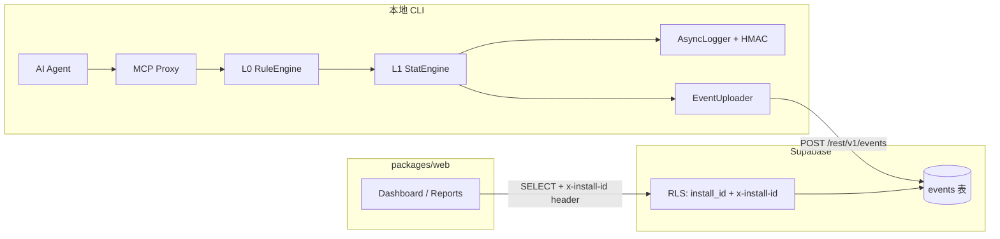

# AgentWatch V0 — 后端 × Supabase × 前端 对接总体规划

> **文档目的**：把「CLI 本地链路 → 云端写入 → Dashboard 读真数据」拆成可执行、可勾选、不易遗忘的任务清单。  
> **最后更新**：2026-07-05  
> **原则**：Landing 页可继续 polish；**对接与前端视觉两条线并行**，但 **Dashboard 真数据优先于 Dashboard 美化**。

---

## 一、最终要证明什么（North Star）

跑通一条可演示、可验收的闭环：

```text
用户运行 agentwatch proxy
  → 某次 tools/call 被 L0/L1 判定为 WARN/BLOCK
  → 脱敏日志写入 ~/.agentwatch/log.jsonl（HMAC 链 intact）
  → EventUploader 批量写入 Supabase events 表
  → 前端 Dashboard（VITE_USE_MOCK=false）用同一 install_id 读到该条记录
```

**Demo 成功标准（必须全部满足）**

- [ ] CLI `audit verify` exit 0
- [ ] Supabase `events` 表出现对应 `event_id`
- [ ] Dashboard 表格/图表展示该条，决策色与 CLI 一致
- [ ] 换错误 `install_id` 时 Dashboard 读不到他人数据（RLS 生效）

---

## 二、当前状态快照（2026-07-05）

| 模块 | 路径 | 完成度 | 说明 |
|------|------|--------|------|
| L0/L1 + Proxy | `packages/local/src/proxy`, `rule`, `stat` | ✅ 可用 | 单元/E2E 测试已有；**非本次优先改 UI** |
| 本地日志 + HMAC | `packages/local/src/logging` | ✅ 可用 | `audit verify` 可验链 |
| EventUploader | `packages/local/src/cloud/EventUploader.ts` | ✅ 框架完成 | 5s flush、RetryQueue |
| CloudClient | `packages/local/src/cloud/CloudClient.ts` | ⚠️ **协议不匹配** | POST `{endpoint}/v1/events/batch` 包装体 |
| cloudEventMapper | `packages/local/src/cloud/cloudEventMapper.ts` | ✅ 可用 | `BehaviorLogEntry` → `CloudEventPayload`（camelCase） |
| Supabase 表 | 云端 | ❌ **待确认/部署** | DDL 需与前端 `AgentWatchEvent` 对齐 |
| 前端读 | `packages/web/src/lib/events.ts` | ✅ 已实现 | `select * from events`，RLS + `x-install-id` |
| 前端写 | — | ❌ 无 | 仅 CLI 侧写入 |
| 前端 Landing | `packages/web/src/pages/Home.tsx` | 🎨 持续优化 | **不阻塞对接** |
| Dashboard | `packages/web/src/pages/Dashboard.tsx` | ⚠️ Mock 默认 | `VITE_USE_MOCK !== 'false'` 时用 mock |

### 关键阻塞（必须先解决）

1. **CloudClient URL 错误**  
   配置 `endpoint: https://…supabase.co/rest/v1/`  
   实际请求：`…/rest/v1/v1/events/batch` → **Supabase 不存在该路由**。

2. **字段命名不一致**  
   - CLI 上报：`CloudEventPayload`（camelCase，嵌套 `toolCall` / `detection`）  
   - 前端/DB：`AgentWatchEvent`（snake_case 扁平，`packages/web/src/types/events.ts`）

3. **install_id 来源未打通**  
   - 前端 Settings：`localStorage agentwatch_install_id`  
   - CLI config：`agentId`（`init` 生成）  
   - **约定**：`install_id === config.agentId`（文档与 Settings 页已暗示，上传时必须写入）

---

## 三、目标架构



---

## 四、阶段划分（按顺序执行，不可跳步）

### Phase A — 本地闭环验证（不涉及云端）

**目标**：确认「安全闸门」在本地真实可用。  
**预计**：0.5～1 天  
**改动范围**：仅运行/文档，**不改核心引擎逻辑**（除非测试失败）。

| ID | 任务 | 命令 / 验收 | 状态 |
|----|------|-------------|------|
| A-1 | 干净环境 init | `npx @agentwatch-web3/cli init` → 生成 `~/.agentwatch/config.yaml` | [ ] |
| A-2 | 记录 agentId | 复制 yaml 中 `agentId`，作为后续 `install_id` | [ ] |
| A-3 | 启动 proxy | `agentwatch proxy` 或文档推荐命令 | [ ] |
| A-4 | 触发 tools/call | 用 echo-mcp / 测试 MCP 触发 ALLOW/WARN/BLOCK 各至少 1 次 | [ ] |
| A-5 | 验日志 | `~/.agentwatch/log.jsonl` 或分级 jsonl 含 `_meta.hmac` | [ ] |
| A-6 | 验链 | `agentwatch audit verify` → exit 0 | [ ] |
| A-7 | 性能抽检 | 日志中 `dur_ms` / 基准测试 P99 仍 < 50ms | [ ] |

**产出物**：`docs/demo_local_runbook.md`（可选，记录实际命令与 agentId）

---

### Phase B — Supabase 基础设施

**目标**：数据库表 + RLS 与前端类型 **100% 对齐**。  
**预计**：0.5 天  
**改动范围**：Supabase Dashboard SQL；**不修改** `packages/shared/types` 字段名（前端已定义）。

#### B-1 events 表 DDL（与 `AgentWatchEvent` 对齐）

在 Supabase SQL Editor 执行（部署前人工 Review）：

```sql
-- 扩展
create extension if not exists "pgcrypto";

create table if not exists public.events (
  id                  uuid primary key default gen_random_uuid(),
  install_id          text not null,
  session_id          text not null,
  agent_id            text not null,
  user_id             text not null,
  event_id            text not null,
  tool_name           text not null,
  service_name        text not null default 'tools/call',
  timestamp_ms        bigint not null,
  duration_ms         integer not null default 0,
  arg_count           integer not null default 0,
  arg_key_hashes      jsonb not null default '[]',
  arg_value_types     jsonb not null default '[]',
  has_address         boolean not null default false,
  has_amount          boolean not null default false,
  amount_bucket       text,
  l0_triggered_rules  jsonb not null default '[]',
  l1_combined_score   double precision not null default 0,
  final_decision      text not null check (final_decision in ('ALLOW','WARN','BLOCK')),
  chain_depth         integer not null default 0,
  previous_tool       text,
  hmac                text not null,
  risk_level          text check (risk_level in ('HIGH','MEDIUM','LOW')),
  created_at          timestamptz not null default now(),

  unique (install_id, event_id)
);

create index if not exists idx_events_install_ts
  on public.events (install_id, timestamp_ms desc);

create index if not exists idx_events_decision
  on public.events (install_id, final_decision);
```

| ID | 任务 | 验收 | 状态 |
|----|------|------|------|
| B-1 | 执行 DDL | 表存在，字段与上表一致 | [ ] |
| B-2 | 确认无废弃字段 | **不要** `risk_score`、`action` 等旧字段 | [ ] |
| B-3 | 插入 1 条手工测试行 | Dashboard mock 关闭后能读到 | [ ] |

#### B-2 RLS 策略（MVP：anon + install_id）

```sql
alter table public.events enable row level security;

-- 读：请求头 x-install-id 必须等于行 install_id
create policy "events_select_by_install"
  on public.events for select
  to anon
  using (
    install_id = coalesce(
      current_setting('request.headers', true)::json->>'x-install-id',
      ''
    )
  );

-- 写：同上（CLI 用 anon key + header 上报）
create policy "events_insert_by_install"
  on public.events for insert
  to anon
  with check (
    install_id = coalesce(
      current_setting('request.headers', true)::json->>'x-install-id',
      ''
    )
  );
```

| ID | 任务 | 验收 | 状态 |
|----|------|------|------|
| B-4 | 启用 RLS + 策略 | 错误 install_id 的 SELECT 返回空 | [ ] |
| B-5 | 验证 header 名 | 与 `packages/web/src/lib/supabase.ts` 一致：`x-install-id` | [ ] |

**环境变量（CLI 侧）**

| 变量 | 用途 |
|------|------|
| `AGENTWATCH_API_KEY` | Supabase **anon** key（写入 config.yaml `${AGENTWATCH_API_KEY}`） |
| `agentId` in config | 同时作为 `install_id` 写入每条 event |

---

### Phase C — CloudClient Supabase 适配（核心开发）

**目标**：EventUploader flush 时，向 Supabase `events` 表 INSERT 扁平 snake_case 行。  
**预计**：1～2 天  
**改动范围**：`packages/local/src/cloud/*` + 单元/集成测试；**禁止**改 `CloudEventPayload` / `AgentWatchEvent` 字段名。

#### C-1 设计决策（写死在本文档，避免遗忘）

| 决策 | 选择 | 理由 |
|------|------|------|
| 上报协议 | Supabase PostgREST `POST /rest/v1/events` | 与现有 endpoint 配置一致 |
| 批量方式 | 单次 POST JSON 数组（多行 insert） | PostgREST 支持 `[{…},{…}]` |
| install_id | 取 `config.agentId` | 与前端 Settings 一致 |
| ALLOW 事件 | **V0 仅上传 WARN/BLOCK**（保持 EventUploader 现有逻辑） | 减噪；Dashboard 可先只看风险事件 |
| 响应解析 | 2xx 即 success；非 2xx 进 RetryQueue | 不依赖 `/v1/events/batch` 响应体 |

#### C-2 新增映射函数

**文件**：`packages/local/src/cloud/supabaseEventMapper.ts`（新建）

`CloudEventPayload` + `installId: string` → Supabase row（snake_case）：

| CloudEventPayload | events 列 |
|-------------------|-----------|
| _(注入)_ `installId` | `install_id` |
| `sessionId` | `session_id` |
| `agentId` | `agent_id` |
| `userId` | `user_id` |
| `eventId` | `event_id` |
| `toolCall.toolName` | `tool_name` |
| `toolCall.serviceName` | `service_name` |
| `timestamp` | `timestamp_ms` |
| `toolCall.durationMs` | `duration_ms` |
| `toolCall.argCount` | `arg_count` |
| `toolCall.argKeyHashes` | `arg_key_hashes` |
| `toolCall.argValueTypes` | `arg_value_types` |
| `toolCall.hasAddress` | `has_address` |
| `toolCall.hasAmount` | `has_amount` |
| `toolCall.amountBucket` | `amount_bucket` |
| `detection.l0TriggeredRules` | `l0_triggered_rules` |
| `detection.l1CombinedScore` | `l1_combined_score` |
| `detection.finalDecision` | `final_decision` |
| `context.chainDepth` | `chain_depth` |
| `context.previousTool` | `previous_tool` |
| `hmac` | `hmac` |
| _(可选计算)_ | `risk_level` ← 由 score + decision 推导 |

#### C-3 改造 CloudClient

**文件**：`packages/local/src/cloud/CloudClient.ts`

| ID | 任务 | 细节 | 状态 |
|----|------|------|------|
| C-3a | 新增 `uploadBatchToSupabase` | URL: `{endpoint}/events`（endpoint 已含 `/rest/v1`） | [x] |
| C-3b | Headers | `apikey`, `Authorization: Bearer`, `Content-Type: application/json`, **`x-install-id: installId`**, `Prefer: return=minimal` | [x] |
| C-3c | 保留旧 batch 接口 | endpoint 含 `supabase.co` 时走新路径 | [x] |
| C-3d | EventUploader 传入 installId | 从 `CloudEventPayload.agentId` 读取，**未改 EventUploader** | [x] |
| C-3e | 结构化错误 | 沿用 `RiskType.CLOUD_CLIENT_UPLOAD_FAILED` | [x] |

#### C-4 测试（必须）

| ID | 文件 | 场景 | 状态 |
|----|------|------|------|
| C-4a | `tests/unit/cloud/supabaseEventMapper.test.ts` | 映射字段完整、snake_case | [x] |
| C-4b | `tests/unit/cloud/upload.test.ts` | mock fetch 验证 URL/headers/body | [x] |
| C-4c | `tests/integration/cloud/supabase-upload.test.ts` | 可选：对真实 Supabase 集成测（CI 用 secret） | [ ] |

**验收命令**

```bash
cd packages/local && npm test -- cloud
```

---

### Phase D — 前端读真数据

**目标**：Dashboard 展示 CLI 写入的事件。  
**预计**：0.5 天  
**改动范围**：`packages/web` 配置 + Settings 文案；**Home Landing 不动**。

| ID | 任务 | 细节 | 状态 |
|----|------|------|------|
| D-1 | Settings 填入 agentId | 与 A-2 相同值保存到 localStorage | [ ] |
| D-2 | 关闭 mock | `VITE_USE_MOCK=false npm run build` 或 `.env.local` | [ ] |
| D-3 | 启动 web | `cd packages/web && npm run dev` | [ ] |
| D-4 | Dashboard 验证 | 表格出现 Supabase 行；错误 install_id 为空 | [ ] |
| D-5 | Reports / 图表 | 有数据后检查空态、筛选是否正常 | [ ] |
| D-6 | 错误提示 | 已有「回退 mock」逻辑，确认 RLS 失败时用户看得懂 | [ ] |

**前端环境文件示例**（`packages/web/.env.local`，不提交 git）

```env
VITE_USE_MOCK=false
```

---

### Phase E — 端到端 Demo 脚本

**目标**：一条命令链可复制给 OKX 验收 / 录屏。  
**预计**：0.5 天

```bash
# 1. 本地
export AGENTWATCH_API_KEY="<supabase_anon_key>"
agentwatch init
export INSTALL_ID=$(grep '^agentId:' ~/.agentwatch/config.yaml | cut -d'"' -f2)
echo "install_id=$INSTALL_ID"

# 2. 启动 proxy（另开终端）并触发 BLOCK 场景
# … 见 echo-mcp / full-pipeline 文档 …

# 3. 等待 flush（≤5s）或查 Supabase Table Editor

# 4. 前端
cd packages/web
echo "VITE_USE_MOCK=false" > .env.local
npm run dev
# Settings → install_id = $INSTALL_ID → Dashboard
```

| ID | 任务 | 状态 |
|----|------|------|
| E-1 | 编写 `docs/demo_e2e_supabase.md` | [ ] |
| E-2 | 录屏 30s：CLI BLOCK → Dashboard 行出现 | [ ] |
| E-3 | README 增加「Live Demo」链接 | [ ] |

---

### Phase F — 前端后续优化（对接完成后再做）

**目标**：有真数据后再美化，避免返工。  
**与对接并行但优先级更低**。

| 区域 | 待优化项 | 状态 |
|------|----------|------|
| Home Landing | 动效/文案/商标字体 | 🎨 进行中 |
| Dashboard | 对齐 Home 字体系（Noto Serif + Cormorant） | [ ] |
| Dashboard | 空态、加载 skeleton、错误态 | [ ] |
| Auth | 与品牌视觉统一；真实登录可 Phase 2 | [ ] |
| 视频资源 | ffmpeg 压缩后再部署 | [ ] |
| Navbar | 「加入 AgentWatch」按钮语义（主题页 vs 功能入口） | [ ] |

---

## 五、两条工作线如何并行（防搞忘）

```text
每周节奏建议：

[主线 70%] Phase A → B → C → D → E（后端对接）
[副线 30%] Phase F（Landing 视觉、文案）

规则：
1. 未完成 Phase C 之前，Dashboard 不做大改版
2. 任何 shared/types 字段变更，必须同时改：DDL + mapper + web/types + 测试
3. 不修改 L0/L1 核心逻辑，除非 Phase A 测试失败
4. 大视频不进 git
```

---

## 六、禁止事项（Review 时自查）

- [ ] 不在 `CloudEventPayload` / `AgentWatchEvent` 私自增删字段名  
- [ ] 不把 `/v1/events/batch` 硬套到 Supabase URL 上  
- [ ] 不在 RLS 完成前用 service_role key 给前端  
- [ ] 不在对接阶段 force push / 提交 `.env`、anon key 到 git  
- [ ] 不为了 Demo 关闭 RLS  

---

## 七、风险登记

| 风险 | 影响 | 缓解 |
|------|------|------|
| Supabase RLS header 读不到 | INSERT/SELECT 全失败 | 先用 SQL 手工 insert 验证；查 PostgREST `request.headers` |
| agentId 与 install_id 不一致 | Dashboard 永远空 | init 后复制 agentId 到 Settings；上传强制同值 |
| 仅 WARN/BLOCK 上传 | Dashboard 看不到 ALLOW | V0 接受；UI 标注「风险事件」 |
| CloudClient 改完破坏旧测试 | CI 红 | 保留 mock fetch 测试；supabase 分支单独 describe |
| 前端 mock 忘记关 | 以为对接失败 | Settings 页显示 Live/Mock 状态（已有） |

---

## 八、完成定义（Definition of Done）

**Phase 0.4 对接完成** = 以下全部打勾：

- [ ] Phase A 全部完成  
- [ ] Supabase DDL + RLS 部署  
- [ ] CloudClient Supabase 路径 + mapper + 单元测试绿  
- [ ] 真实 proxy 运行后 Supabase 有行  
- [ ] Dashboard `VITE_USE_MOCK=false` 可看到该行  
- [ ] `docs/demo_e2e_supabase.md` 可让他人复现  
- [ ] CLI 测试套件仍通过（`packages/local npm test`）  

---

## 九、相关文件索引（快速跳转）

| 用途 | 路径 |
|------|------|
| 云端 HTTP 客户端 | `packages/local/src/cloud/CloudClient.ts` |
| 日志→上报载荷 | `packages/local/src/cloud/cloudEventMapper.ts` |
| 定时批量上报 | `packages/local/src/cloud/EventUploader.ts` |
| 默认 cloud 配置 | `packages/local/src/cli/lib/config-template.ts` |
| 前端事件类型 | `packages/web/src/types/events.ts` |
| 前端拉取逻辑 | `packages/web/src/lib/events.ts` |
| Supabase 客户端 | `packages/web/src/lib/supabase.ts` |
| install_id 设置 | `packages/web/src/pages/Settings.tsx` |
| E2E 参考 | `docs/e2e_full_pipeline.md` |
| 架构任务总表 | `docs/agentwatch_v0_mvp_tasklist.md` |

---

## 十、进度总览（手动更新）

| 阶段 | 状态 | 完成日期 |
|------|------|----------|
| Phase A 本地闭环 | ⬜ 待人工执行 | 见 `docs/demo_e2e_supabase.md` §1 |
| Phase B Supabase | ⬜ 待人工 SQL | `docs/supabase/events_ddl.sql` 已就绪 |
| Phase C CloudClient | ✅ 适配层完成 | mapper + transport + 测试 36 passed |
| Phase D 前端 Live | ⬜ 待 B 部署后 | `.env.example` 已就绪 |
| Phase E Demo 文档 | ✅ 脚本已写 | `docs/demo_e2e_supabase.md` |
| Phase F 前端 polish | 🔄 进行中（Home） | |

---

## 十一、下一步行动（现在就做）

1. **你**：在 Supabase 执行 Phase B DDL + RLS，确认 Table Editor 能手工增删查。  
2. **开发**：从 Phase C-2 `supabaseEventMapper.ts` 开始，接 CloudClient。  
3. **并行**：Home 视觉微调放 Phase F，不占用主线时间。

> 需要我开始写 Phase C 代码时，直接说：**「按 integration_plan 做 Phase C」**。
