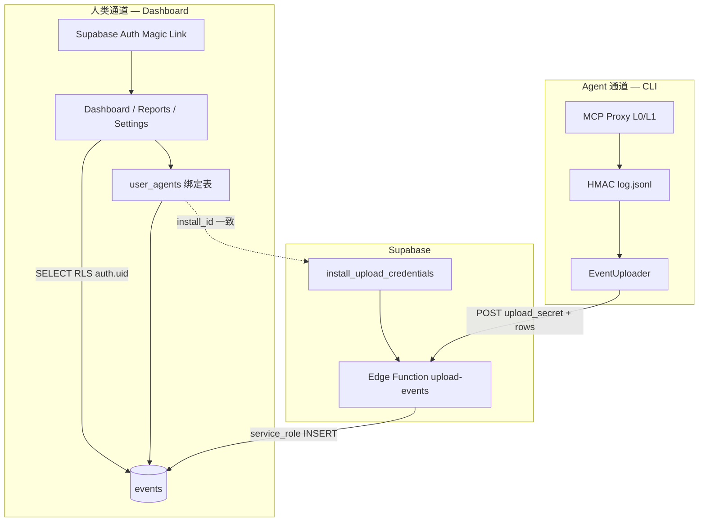

# AgentWatch 登录与绑定系统 — 目标规格（v1）

> **文档目的**：对齐人类登录、多 Agent 绑定、CLI 上报鉴权三套机制；作为 Phase 04 之后 Supabase / 前端 / CLI 配套改动的唯一参考。  
> **最后更新**：2026-07-05  
> **关联文档**：`integration_plan_phase04.md`、`supabase/events_ddl.sql`  
> **已确认选型**（产品拍板）：
> 1. v1 登录：**Magic Link 邮件免密**，不做邮箱密码体系；
> 2. v1 绑定：**用户手动粘贴 `install_id`** 完成账号与 Agent 实例关联；
> 3. CLI 上报：**废弃 anon + `x-install-id`**，改为 **`upload_secret` + 服务端 `service_role` 写入**，杜绝伪造审计日志。

---

## 一、North Star（登录系统要证明什么）

```text
人类 Magic Link 登录 Dashboard
  → Settings 粘贴 install_id（= CLI agentId）完成绑定
  → Dashboard / Reports 只读「本人绑定的 install_id」下的 events
  → CLI Proxy 本地 L0/L1 + HMAC 不变
  → EventUploader 携带 upload_secret 调用云端入口
  → 服务端校验 secret 后以 service_role INSERT events
  → 未绑定 / secret 错误 / 伪造 install_id 均无法写入或读取他人数据
```

**与 `integration_plan_phase04.md` 的关系**：Phase 04 的 Demo 闭环（Proxy → events → Dashboard）保留；本文件替换其中 **RLS / 鉴权 / Auth** 章节的目标态，**不修改** L0/L1、HMAC、Home 页面。

---

## 二、双通道身份模型

| 通道 | 对象 | 凭证 | 用途 |
|------|------|------|------|
| **人类通道** | 浏览器 Dashboard 用户 | Supabase Auth Session（Magic Link） | 登录、绑定 install_id、读 events |
| **Agent 通道** | 本地 CLI / Proxy | `install_id` + `upload_secret`（`~/.agentwatch/config.yaml`） | 脱敏 events 上报（无 Dashboard Session） |

**命名约定（全项目统一）**

| 字段 | 含义 |
|------|------|
| `install_id` | CLI `agentwatch init` 生成的 `agentId`，events 分区键 |
| `auth.users.id` | Dashboard 登录用户 UUID，**≠** `events.user_id` |
| `events.user_id` | Agent 侧配置标识（可为 `default` / OKX wallet 等），**≠** 网页登录用户 |
| `upload_secret` | 每 install 独立上报密钥，仅 CLI 持有明文；库内只存 `secret_hash` |

---

## 三、目标架构



**硬性约束**

- 不修改 `Home.tsx`、L0/L1 风控核心、HMAC 链式日志业务逻辑；
- 仅新增：Auth、绑定、`install_upload_credentials`、Edge Function（或等效 RPC）、前端读路径、CLI 上报头。

---

## 四、数据库 DDL（Supabase SQL Editor 执行）

> 执行顺序：① extensions → ② 新表 → ③ 改 events RLS → ④ 函数/策略 → ⑤ Auth 触发器。  
> **`events` 表体结构不变**（与 `packages/web/src/types/events.ts` 一致）；仅调整 RLS 与写入路径。

### 4.1 扩展与用户资料

```sql
-- ─── 0. 扩展 ───
create extension if not exists "pgcrypto";

-- ─── 1. 用户资料（Magic Link 注册后自动创建）───
create table if not exists public.profiles (
  id            uuid primary key references auth.users(id) on delete cascade,
  email         text,
  display_name  text,
  created_at    timestamptz not null default now(),
  updated_at    timestamptz not null default now()
);

create or replace function public.handle_new_user()
returns trigger
language plpgsql
security definer
set search_path = public
as $$
begin
  insert into public.profiles (id, email, display_name)
  values (
    new.id,
    new.email,
    coalesce(new.raw_user_meta_data->>'display_name', split_part(new.email, '@', 1))
  )
  on conflict (id) do update
    set email = excluded.email,
        updated_at = now();
  return new;
end;
$$;

drop trigger if exists on_auth_user_created on auth.users;
create trigger on_auth_user_created
  after insert on auth.users
  for each row execute function public.handle_new_user();
```

### 4.2 用户 ↔ Agent 绑定（v1：手动粘贴 install_id）

```sql
-- ─── 2. 用户绑定的 Agent 实例 ───
create table if not exists public.user_agents (
  id           uuid primary key default gen_random_uuid(),
  user_id      uuid not null references auth.users(id) on delete cascade,
  install_id   text not null,
  label        text not null default 'My Agent',
  linked_at    timestamptz not null default now(),
  updated_at   timestamptz not null default now(),

  constraint user_agents_install_id_nonempty check (char_length(trim(install_id)) > 0),
  unique (user_id, install_id)
);

create index if not exists idx_user_agents_user
  on public.user_agents (user_id, linked_at desc);

create index if not exists idx_user_agents_install
  on public.user_agents (install_id);
```

### 4.3 CLI 上报凭证（upload_secret，库内仅 hash）

```sql
-- ─── 3. 每个 install_id 一条上报凭证（与 user_agents 解耦：先有 secret 才能写 events）───
create table if not exists public.install_upload_credentials (
  install_id     text primary key,
  secret_hash    text not null,
  secret_prefix  text not null,          -- 前 8 字符，便于 Settings 页展示「已注册 aw_xxxx…」
  enabled        boolean not null default true,
  created_at     timestamptz not null default now(),
  rotated_at     timestamptz,
  last_used_at   timestamptz,

  constraint install_upload_credentials_hash_nonempty check (char_length(secret_hash) > 0)
);

create index if not exists idx_install_upload_credentials_enabled
  on public.install_upload_credentials (install_id)
  where enabled = true;
```

**`upload_secret` 生成规则（CLI `agentwatch init` 配套逻辑，本文档定义）**

- 格式：`aw_` + 32 字节 random → base64url（约 43 字符）；
- 明文仅存 `~/.agentwatch/config.yaml` 的 `cloud.uploadSecret`（文件权限 **0600**）；
- 入库：`secret_hash = encode(digest(upload_secret, 'sha256'), 'hex')`；
- **禁止**将 `service_role` 或 `upload_secret` 明文写入前端或 git。

### 4.4 events 表（若尚未建表，与 Phase B 一致）

```sql
-- ─── 4. events（已部署则跳过 create，仅执行 §4.5 RLS 变更）───
-- 完整 DDL 见 docs/supabase/events_ddl.sql
```

### 4.5 废弃 anon 读写策略，启用目标态 RLS

```sql
-- ─── 5. 移除旧 anon + x-install-id 策略 ───
drop policy if exists "events_select_by_install" on public.events;
drop policy if exists "events_insert_by_install" on public.events;

alter table public.events enable row level security;

-- 5.1 登录用户：只能 SELECT 自己绑定的 install_id
create policy "events_select_own_agents"
  on public.events for select
  to authenticated
  using (
    install_id in (
      select ua.install_id
      from public.user_agents ua
      where ua.user_id = auth.uid()
    )
  );

-- 5.2 禁止任何客户端直连 INSERT（含 anon / authenticated）
--     写入仅允许 service_role（Edge Function 服务端持有）
--     不创建 INSERT policy → PostgREST 下 authenticated/anon 无法插入

-- 5.3 profiles / user_agents / install_upload_credentials 的 RLS
alter table public.profiles enable row level security;
alter table public.user_agents enable row level security;
alter table public.install_upload_credentials enable row level security;

create policy "profiles_select_own"
  on public.profiles for select to authenticated
  using (id = auth.uid());

create policy "profiles_update_own"
  on public.profiles for update to authenticated
  using (id = auth.uid())
  with check (id = auth.uid());

create policy "user_agents_select_own"
  on public.user_agents for select to authenticated
  using (user_id = auth.uid());

create policy "user_agents_insert_own"
  on public.user_agents for insert to authenticated
  with check (user_id = auth.uid());

create policy "user_agents_update_own"
  on public.user_agents for update to authenticated
  using (user_id = auth.uid())
  with check (user_id = auth.uid());

create policy "user_agents_delete_own"
  on public.user_agents for delete to authenticated
  using (user_id = auth.uid());

-- install_upload_credentials：用户不可直接读 hash；仅通过 RPC/Edge Function 间接操作
-- 不对 authenticated 开放 SELECT/INSERT/UPDATE（默认 deny）
```

### 4.6 绑定与注册 upload_secret 的 RPC（authenticated 调用）

```sql
-- ─── 6. RPC：绑定 install_id（v1 手动粘贴）───
create or replace function public.bind_install_id(
  p_install_id text,
  p_label text default 'My Agent'
)
returns public.user_agents
language plpgsql
security definer
set search_path = public
as $$
declare
  v_row public.user_agents;
  v_uid uuid := auth.uid();
begin
  if v_uid is null then
    raise exception 'not_authenticated';
  end if;
  if p_install_id is null or char_length(trim(p_install_id)) = 0 then
    raise exception 'invalid_install_id';
  end if;

  insert into public.user_agents (user_id, install_id, label)
  values (v_uid, trim(p_install_id), coalesce(nullif(trim(p_label), ''), 'My Agent'))
  on conflict (user_id, install_id) do update
    set label = excluded.label,
        updated_at = now()
  returning * into v_row;

  return v_row;
end;
$$;

revoke all on function public.bind_install_id(text, text) from public;
grant execute on function public.bind_install_id(text, text) to authenticated;

-- ─── 7. RPC：注册/轮换 upload_secret（绑定页第二栏，与「设备关联」分离）───
-- 用户从 CLI `agentwatch status` 复制 upload_secret，一次性注册 hash
create or replace function public.register_upload_secret(
  p_install_id text,
  p_upload_secret text
)
returns jsonb
language plpgsql
security definer
set search_path = public
as $$
declare
  v_uid uuid := auth.uid();
  v_bound boolean;
  v_hash text;
  v_prefix text;
begin
  if v_uid is null then
    raise exception 'not_authenticated';
  end if;
  if p_install_id is null or p_upload_secret is null then
    raise exception 'invalid_arguments';
  end if;
  if char_length(p_upload_secret) < 24 then
    raise exception 'upload_secret_too_short';
  end if;

  select exists(
    select 1 from public.user_agents ua
    where ua.user_id = v_uid and ua.install_id = trim(p_install_id)
  ) into v_bound;

  if not v_bound then
    raise exception 'install_not_bound_to_user';
  end if;

  v_hash := encode(digest(p_upload_secret, 'sha256'), 'hex');
  v_prefix := left(p_upload_secret, 8);

  insert into public.install_upload_credentials (install_id, secret_hash, secret_prefix, enabled)
  values (trim(p_install_id), v_hash, v_prefix, true)
  on conflict (install_id) do update
    set secret_hash = excluded.secret_hash,
        secret_prefix = excluded.secret_prefix,
        enabled = true,
        rotated_at = now();

  return jsonb_build_object(
    'install_id', trim(p_install_id),
    'secret_prefix', v_prefix,
    'registered', true
  );
end;
$$;

revoke all on function public.register_upload_secret(text, text) from public;
grant execute on function public.register_upload_secret(text, text) to authenticated;
```

### 4.7 上报写入 RPC（仅 service_role / Edge Function 调用）

```sql
-- ─── 8. 批量写入 events（校验 upload_secret 后 INSERT）───
create or replace function public.ingest_events_with_secret(
  p_install_id text,
  p_upload_secret text,
  p_rows jsonb
)
returns jsonb
language plpgsql
security definer
set search_path = public
as $$
declare
  v_cred public.install_upload_credentials;
  v_hash text;
  v_inserted int := 0;
  v_row jsonb;
begin
  if p_install_id is null or p_upload_secret is null or p_rows is null then
    raise exception 'invalid_arguments';
  end if;
  if jsonb_typeof(p_rows) <> 'array' then
    raise exception 'rows_must_be_array';
  end if;

  select * into v_cred
  from public.install_upload_credentials c
  where c.install_id = trim(p_install_id) and c.enabled = true;

  if not found then
    raise exception 'upload_credentials_not_found';
  end if;

  v_hash := encode(digest(p_upload_secret, 'sha256'), 'hex');
  if v_hash <> v_cred.secret_hash then
    raise exception 'invalid_upload_secret';
  end if;

  for v_row in select * from jsonb_array_elements(p_rows)
  loop
    insert into public.events (
      install_id, session_id, agent_id, user_id, event_id,
      tool_name, service_name, timestamp_ms, duration_ms,
      arg_count, arg_key_hashes, arg_value_types,
      has_address, has_amount, amount_bucket,
      l0_triggered_rules, l1_combined_score, final_decision,
      chain_depth, previous_tool, hmac
    )
    values (
      trim(p_install_id),
      v_row->>'session_id',
      coalesce(v_row->>'agent_id', trim(p_install_id)),
      coalesce(v_row->>'user_id', 'default'),
      v_row->>'event_id',
      v_row->>'tool_name',
      coalesce(v_row->>'service_name', 'tools/call'),
      (v_row->>'timestamp_ms')::bigint,
      coalesce((v_row->>'duration_ms')::int, 0),
      coalesce((v_row->>'arg_count')::int, 0),
      coalesce(v_row->'arg_key_hashes', '[]'::jsonb),
      coalesce(v_row->'arg_value_types', '[]'::jsonb),
      coalesce((v_row->>'has_address')::boolean, false),
      coalesce((v_row->>'has_amount')::boolean, false),
      nullif(v_row->>'amount_bucket', ''),
      coalesce(v_row->'l0_triggered_rules', '[]'::jsonb),
      coalesce((v_row->>'l1_combined_score')::double precision, 0),
      v_row->>'final_decision',
      coalesce((v_row->>'chain_depth')::int, 0),
      nullif(v_row->>'previous_tool', ''),
      v_row->>'hmac'
    )
    on conflict (install_id, event_id) do nothing;

    v_inserted := v_inserted + 1;
  end loop;

  update public.install_upload_credentials
  set last_used_at = now()
  where install_id = trim(p_install_id);

  return jsonb_build_object('accepted', v_inserted);
end;
$$;

-- 仅 service_role 可调用（Edge Function 内使用 service_role 客户端）
revoke all on function public.ingest_events_with_secret(text, text, jsonb) from public;
grant execute on function public.ingest_events_with_secret(text, text, jsonb) to service_role;
```

---

## 五、Edge Function：`upload-events`（推荐）

> **为何不用 CLI 直连 PostgREST + service_role**：`service_role` 绝不能下发到用户 CLI；必须由服务端持有。

**路径**：`POST https://<project>.supabase.co/functions/v1/upload-events`

**请求头**

| Header | 说明 |
|--------|------|
| `Content-Type` | `application/json` |
| `Authorization` | `Bearer <SUPABASE_ANON_KEY>`（仅用于过网关；鉴权靠 body 内 secret） |

**请求体**

```json
{
  "install_id": "agent_xxxxxxxx",
  "upload_secret": "aw_…………",
  "events": [ { "...": "与 SupabaseEventRow snake_case 一致" } ]
}
```

**服务端逻辑（伪代码）**

```typescript
// Deno Edge Function — 环境变量：SUPABASE_SERVICE_ROLE_KEY
const admin = createClient(SUPABASE_URL, SUPABASE_SERVICE_ROLE_KEY);
const { install_id, upload_secret, events } = await req.json();
const { data, error } = await admin.rpc('ingest_events_with_secret', {
  p_install_id: install_id,
  p_upload_secret: upload_secret,
  p_rows: events,
});
if (error?.message?.includes('invalid_upload_secret')) return 401;
return Response.json(data);
```

**CLI 改动范围（配套，不动 L0/L1/HMAC）**

| 文件 | 改动 |
|------|------|
| `packages/local/src/cloud/supabaseCloudTransport.ts` | POST Edge Function URL；body 含 `upload_secret`；**移除** `x-install-id` 与 anon INSERT |
| `packages/local/src/config/cloud-config.ts` | 读取 `AGENTWATCH_UPLOAD_SECRET` / `cloud.uploadSecret`；**废弃** 用 anon key 写 events |
| `packages/local/src/cli/commands/init.ts` | init 时生成 `uploadSecret` 写入 config |
| `packages/shared/types/config.types.ts` | `CloudConfig` 增加 `uploadSecret?: string`（仅文档化字段，实现阶段添加） |

**环境变量（CLI）**

| 变量 | 用途 |
|------|------|
| `AGENTWATCH_UPLOAD_SECRET` | 上报鉴权（替代原 `AGENTWATCH_API_KEY` 写库用途） |
| `AGENTWATCH_CLOUD_ENDPOINT` | Supabase 项目 URL（Edge Function 基址） |

原 `AGENTWATCH_API_KEY`（anon）：**仅保留给本地开发调试 Frontend 的说明，CLI 写 events 不再使用。**

---

## 六、Magic Link 登录（v1）

### 6.1 Supabase Dashboard 配置

1. Authentication → Providers → **Email**：开启 **Magic Link**，关闭 Email + Password（或禁用「Confirm password」注册）。
2. Site URL / Redirect URLs：加入本地与生产 Dashboard 地址（如 `http://localhost:5173/#/dashboard`）。
3. Email 模板：可选品牌化「Agent Watch 登录链接」。

### 6.2 前端会话流

```text
/auth 输入邮箱 → signInWithOtp({ email, options: { emailRedirectTo } })
  → 用户点邮件链接 → Supabase 建立 session → 跳转 /dashboard
  → supabase.auth.getSession() 持久化
  → 未登录访问 /dashboard /reports /settings → 重定向 /auth
```

**不做**：密码注册、密码重置、OAuth（v2 可选 Wallet SIWE）。

---

## 七、v1 用户操作流程

### 7.1 首次使用

```text
1. CLI: agentwatch init
   → 得到 agentId（= install_id）与 upload_secret（终端展示一次）

2. Web: /auth Magic Link 登录

3. Settings → 「添加 Agent」
   → 粘贴 install_id → 调用 bind_install_id RPC
   → 粘贴 upload_secret → 调用 register_upload_secret RPC
   （绑定仅 install_id；secret 为上报鉴权注册，同一页两步完成）

4. CLI: agentwatch proxy -- …
   → WARN/BLOCK 事件经 Edge Function 写入 events

5. Dashboard: Agent 切换器选择 install_id → 查看事件
```

### 7.2 多 Agent

- `user_agents` 多行；Dashboard 顶栏下拉当前 `install_id`；
- 每个 `install_id` 独立 `upload_secret` 与 `install_upload_credentials` 行。

---

## 八、前端改动清单（禁止改 Home）

| 优先级 | 文件 | 改动 |
|--------|------|------|
| P0 | `packages/web/src/lib/supabase.ts` | 导出带 `auth` 的 client；移除 `getSupabaseForInstall` 的 `x-install-id` 读路径；`fetchEvents` 用 **session + RLS** |
| P0 | `packages/web/src/lib/auth.ts` | **新建**：`signInWithMagicLink`、`signOut`、`onAuthStateChange`、`requireAuth` |
| P0 | `packages/web/src/pages/Auth.tsx` | 去掉 Password 字段；`signInWithOtp`；成功提示「请查收邮件」；移除假登录跳转（保留「Demo 跳过」仅 `VITE_USE_MOCK=true`） |
| P0 | `packages/web/src/App.tsx` | 保护路由 `/dashboard`、`/reports`、`/settings` |
| P0 | `packages/web/src/pages/Settings.tsx` | Agent 列表：粘贴 `install_id` 绑定；粘贴 `upload_secret` 注册；展示 `secret_prefix` 状态 |
| P0 | `packages/web/src/lib/userAgents.ts` | **新建**：`listUserAgents`、`bindInstallId`、`registerUploadSecret`（RPC 封装） |
| P1 | `packages/web/src/pages/Dashboard.tsx` | Agent 切换器；当前 install 来自 `user_agents` 而非仅 localStorage |
| P1 | `packages/web/src/components/dashboard/DashboardHeader.tsx` | 显示登录邮箱、当前 Agent label、登出 |
| P1 | `packages/web/src/components/dashboard/Sidebar.tsx` | 文案：RLS 按登录用户绑定 |
| P2 | `packages/web/src/types/events.ts` | 逐步废弃单键 `INSTALL_ID_KEY` 作为唯一真相；mock 模式保留 |
| — | `packages/web/src/pages/Home.tsx` | **不修改** |

**环境变量（Web）**

```env
VITE_SUPABASE_URL=https://xxxx.supabase.co
VITE_SUPABASE_ANON_KEY=eyJ...
VITE_USE_MOCK=false
```

---

## 九、CLI / 云端配套改动清单（不动 L0/L1/HMAC）

| 优先级 | 模块 | 改动 |
|--------|------|------|
| P0 | `supabaseCloudTransport.ts` | Edge Function + `upload_secret` |
| P0 | `cloud-config.ts` | 校验 `uploadSecret` 存在才启用上传 |
| P0 | `init` 命令 | 生成并持久化 `uploadSecret` |
| P0 | `status` 命令 | 展示 `install_id`、upload secret 前缀、是否已注册（可选 RPC） |
| P1 | `config-template.yaml` | `cloud.uploadSecret: ${AGENTWATCH_UPLOAD_SECRET}` |
| P1 | 单测 | mock Edge Function / RPC；覆盖 secret 错误 401 |
| — | L0/L1/RuleEngine/HMACChain/DecisionRouter | **不修改** |

---

## 十、安全与威胁模型

| 威胁 | 旧方案（anon + x-install-id） | 新方案 |
|------|--------------------------------|--------|
| 猜到 install_id 读他人 Dashboard | 可能（anon SELECT + header） | 需登录且 `user_agents` 绑定 |
| 伪造 events 污染审计 | 可能（anon INSERT + header） | 需正确 `upload_secret` + RPC |
| upload_secret 泄露 | — | 轮换 `register_upload_secret`；旧 hash 覆盖 |
| service_role 泄露 | — | 仅 Edge Function 环境变量；不进 CLI |

**审计完整性**：HMAC 链仍在本地 `log.jsonl` 验真；云端 events 为脱敏副本，**写入权限**与 **人类读权限** 分离。

---

## 十一、验收标准（Login v1 Done）

- [ ] Magic Link 登录成功；未登录无法访问 Dashboard 真数据
- [ ] `bind_install_id` 后 `user_agents` 有行；重复粘贴幂等
- [ ] `register_upload_secret` 后 CLI 上报成功；错误 secret 返回 401
- [ ] 用户 A 无法 SELECT 用户 B 的 `install_id` events
- [ ] anon 直连 PostgREST `INSERT events` 失败
- [ ] `agentwatch audit verify` 仍 exit 0（本地 HMAC 未破坏）
- [ ] Home 页面 git diff 为空

---

## 十二、实施顺序（建议）

```text
Step 1  Supabase：执行 §四 SQL + 部署 Edge Function
Step 2  CLI：init 生成 secret + supabaseCloudTransport 改走 Edge Function
Step 3  Web：Magic Link + 路由守卫
Step 4  Web：Settings 绑定 + secret 注册 + Dashboard 多 Agent
Step 5  端到端：phase-d-test-cases → Dashboard Live → 黑客松录屏
```

**与 OKX 黑客松**：7/17 前若 Auth 未完工，可用 `VITE_USE_MOCK=true` 或 **临时** Demo 账号完成录屏；**提交表单中声明** Login v1 已设计并完成 SQL/RPC（附本文档链接）。正式 RLS 切换应在 Demo 录屏完成后执行，避免录屏期间 Supabase 空数据。

---

## 十三、与 Phase 04 文档的差分摘要

| 项目 | Phase 04 原方案 | 本文档目标态 |
|------|-----------------|--------------|
| Dashboard 读 | anon + `x-install-id` | authenticated + `user_agents` RLS |
| CLI 写 | anon + `x-install-id` | Edge Function + `upload_secret` + service_role RPC |
| 登录 | 无 / 假 Auth UI | Magic Link |
| 多 Agent | localStorage 单 install_id | `user_agents` 表 + UI 切换 |
| `AGENTWATCH_API_KEY` | anon 写库 | **废弃写库**；CLI 改用 `AGENTWATCH_UPLOAD_SECRET` |

---

## 十四、参考

- [Supabase Magic Link](https://supabase.com/docs/guides/auth/auth-email-passwordless)
- [Supabase Edge Functions](https://supabase.com/docs/guides/functions)
- [Row Level Security](https://supabase.com/docs/guides/auth/row-level-security)
- 项目内：`docs/supabase/events_ddl.sql`、`docs/integration_plan_phase04.md`
